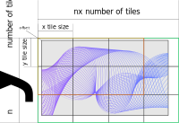

Slice and Merge provides a tool for slicing and merging large images.
This can make it easier to process large images.
The main class is TiledImage.
It represents a 3D array as a 5D array of tiles.
Each tile can be accessed by its index.
Also a list of all tiles is accessible.
If each tile has been processed separately, the merge method can easily combine these tiles into a full-size image.



Example of use:
```python
from PIL import Image
from slice_merge.slice_merge import TiledImage
path_to_image = '<path to your image>'
image = np.array(Image.open(path_to_image))
sliced_image = TiledImage(image)
```
Now, a list of tiles can be retrieved by
```python
sliced_image.list_tiles()
```
Let's apply a simple funtion that returns the Red channel of a RGB imput image.
First, define the function:
```python
def get_red_channel(img):
    return img[:, :, 0]
```
Then apply the function to every tile:
```python
red_tiles = [get_red_channel(tile) for tile in sliced_image.list_tiles()]
```
or
```python
red_tiles = sliced_image.apply(get_red_channel)
```
And finally combine results into the full-size image:
```python
red_full_size = sliced_image.merge(red_tiles)
```
